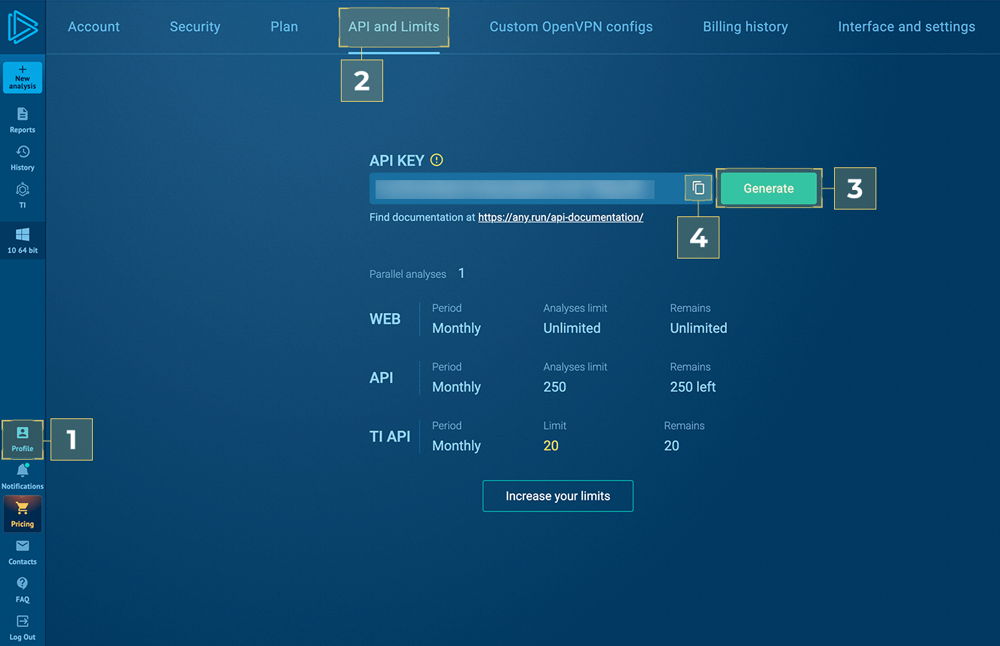

 ## About the connector

ANY.RUN empowers SOC teams to cut MTTD/MTTR with fast verdicts using the Interactive Sandbox. 
Add the ANY.RUN Cloud Sandbox connector as a step in FortiSOAR™ playbooks and perform automated operations to achieve: 
- **Faster triage**: Submit files/URLs for instant analysis across Windows, Linux, Android. Get answers in seconds to catch threats that beat standard defenses and increase the detection rate by up to 36%.
- **Streamlined workflows**: Retrieve reports (JSON, HTML, IOCs) directly in FortiSOAR without tool-switching. Act without delays to stop attacks before they have a chance to hurt your infrastructure. 

### Version information

- Connector Version: 1.2.0 
- FortiSOAR™ Version Tested on: 7.6.4-5623 
- Authored By: ANY.RUN 

## Release Notes for version 1.2.0

Following enhancements have been made to the ANY.RUN connector in version 1.2.0: 
- Connector: ANY.RUN 1.1.0 is deprecated. Use ANY.RUN 1.2.0 connector instead. 
- Playbooks: Added new playbooks. These playbooks perform File\URL analysis using Windows\Linux\Android VM and delivering fast, detailed threat insights: 

  - ANY.RUN Detonate File on Windows 
  - ANY.RUN Detonate File on Linux 
  - ANY.RUN Detonate File on Android 
  - ANY.RUN Detonate URL on Windows 
  - ANY.RUN Detonate URL on Linux 
  - ANY.RUN Detonate URL on Android 


## Installing the connector

Use the Content Hub to install the connector. For the detailed procedure to install a connector, click [here](https://docs.fortinet.com/document/fortisoar/0.0.0/installing-a-connector/1/installing-a-connector)

You can also use the following `yum` command as a root user to install connectors from an SSH session:

```

yum install cyops-connector-anyrun-sandbox

```

## Prerequisites to configuring the connector

- Credentials are required to access the ANY.RUN Cloud Sandbox. Ensure you have an ANY.RUN account with API access. For more information about the products, click [ANY.RUN Cloud Sandbox](https://any.run/features/?utm_source=anyrungithub&utm_medium=documentation&utm_campaign=fortisoar&utm_content=linktosandboxlanding)
- The FortiSOAR™ server should have outbound connectivity to port 443 on the ANY.RUN Cloud Sandbox.


## Configuring the connector

For the procedure to configure a connector, click [here](https://docs.fortinet.com/document/fortisoar/0.0.0/configuring-a-connector/1/configuring-a-connector)

### Configuration parameters

In FortiSOAR™, on the Connectors page, click the **ANY.RUN Cloud Sandbox** connector row (if you are in the **Grid** view on the Connectors page) and in the **Configurations** tab enter the required configuration details: 

| Parameter | Description |
|--|--| 
| API Key | ANY.RUN API Key in format:`"NS9sY..FwvfR"`to access the ANY.RUN APIs  |
| Verify SSL | Specifies whether the SSL certificate for the server is to be verified or not. By default, this option is set as True. |

### Generate API Key

- Follow [ANY.RUN](https://app.any.run/?utm_source=anyrungithub&utm_medium=documentation&utm_campaign=fortisoar&utm_content=linktoservice)
- Profile > [2] API and Limits > [3] Generate > [4] Copy

 


## Actions supported by the connector

The following automated operations can be included in playbooks, and you can also use the annotations to access operations from FortiSOAR™:

| Function               | Description                                                                                                                                                                                                         | Annotation and Category                  |
|------------------------|---------------------------------------------------------------------------------------------------------------------------------------------------------------------------------------------------------------------|------------------------------------------|
| Get Analysis Verdict   | Get the analysis verdict.                                                                                                                                                                                           | `get_analysis_verdict` (Investigation)   |
| Delete Analysis        | Deletes a analysis from ANY.RUN Cloud Sandbox based on the UUID you have specified.                                                                                                                                 | `delete_analysis` (Investigation)        |
| Detonate File          | Detonates a file in ANY.RUN Cloud Sandbox based on the indicator\attachment IRI you have specified.                                                                                                                 | `detonate_file` (Investigation)          |
| Detonate URL           | Detonates a URL in ANY.RUN Cloud Sandbox based on the URL you have specified.                                                                                                                                       | `detonate_url` (Investigation)           |
| Get History            | Retrieves analysis history from ANY.RUN Cloud Sandbox based on input parameters you have specified.                                                                                                                 | `get_user_history` (Investigation)       |
| Get Report             | Retrieves a report for the specified analysis ID from ANY.RUN Cloud Sandbox based on the Analysis ID you have specified. The Analysis ID is generated when you have submitted an analysis to ANY.RUN Cloud Sandbox. | `get_report` (Investigation)             |
| Get Report Attachments | Retrieves several report attachments such as the HTML report from ANY.RUN Cloud Sandbox based on the analysis UUID you have specified.                                                                              | `get_report_attachments` (Investigation) |
| Get User Limits        | Retrieves the request limits of the authenticated user, according to the subscribed plan, from ANY.RUN.                                                                                                             | `get_user_limits` (Investigation)        |

### Operation: Get Analysis Verdict

#### Input parameters

| Parameter   | Description                                                                |
|-------------|----------------------------------------------------------------------------|
| Analysis ID | Specify the UUID of the Analysis you want to get the analysis verdict for. |

#### Output

The output contains the following populated JSON schema: 

```

{
  "error": "",
  "data": {
    "verdict": "",
    "status": ""
  }
}


```


### Operation: Delete Analysis

#### Input parameters

| Parameter | Description                                                       |
|--|-------------------------------------------------------------------|
| Analysis ID | Specify the UUID of the analysis you want to delete from ANY.RUN. |

#### Output

The output contains the following populated JSON schema: 

```

{
  "error": "",
  "data": {
    "status": ""
  }
}
```


### Operation: Detonate File

#### Input parameters

| Parameter | Description |
|--|--|
| Attachment IRI | IRI of the attachment\indicator you want to detonate in ANY.RUN Cloud Sandbox.  |
| Operating system | Specify the OS you want to detonate the file on (Windows / Linux / Android).  |

Parameters for Operating system: Windows

| Parameter | Description |
|--|--|
| Timeout | Timeout for the analysis. By default, this is set to "240" |
| Bitness | Bitness of OS on which you want to run the ANY.RUN Cloud Sandbox analysis. By default, this is set to "64". The allowed values are "32" and "64"" |
| Locale | Locale of OS on which you want to run the ANY.RUN Cloud Sandbox analysis. By default, this is set to "en-US" |
| ENV Type | Environment preset type. You can select development env for OS Windows 10 x64. For all other cases, complete env is required. Possible values are: development, complete. Default is complete. |
| ENV Version | Version of OS. Possible values are: 7, 10, 11. Default is 10. |
| Force elevation | Forces the file to execute with elevated privileges and an elevated token (for PE32, PE32+, PE64 files only). Default is False." |
| Start folder | Start file analysis from the specified directory. Possible values are: desktop, home, downloads, appdata, temp, windows, root. Default is temp. |
| Execute Command | Optional command line |
| Extension to use | Change extension to valid. Default is True |
| Network Connection State | Network connection state. Default is True |
| FakeNet Feature Status | FakeNet feature status. Default is False |
| Geo Location | 	Tor geo location option. Example: US, AU. Default is fastest |
| FakeNet Feature Status | FakeNet feature status. Default is False |
| HTTPS MITM Proxy | HTTPS MITM proxy option. Default is False |
| Residential Proxy | Residential proxy using. Default is False |
| Residential Proxy Geo Location | Residential proxy geo location option. Example: US, AU. Default is fastest |
| TOR Using | TOR using. Default is False |
| Privacy Setting | Privacy settings. Possible values are: public, bylink, owner, byteam. Default is bylink. |

Parameters for Operating system: Linux

| Parameter | Description |
|--|--|
| Timeout | Timeout for the analysis. By default, this is set to "240" |
| Locale | Locale of OS on which you want to run the ANY.RUN Cloud Sandbox analysis. By default, this is set to "en-US" |
| Environment | Operating system. Possible values are: ubuntu, debian. Default is ubuntu. |
| Start folder | Start file analysis from the specified directory. Possible values are: desktop, home, downloads, appdata, temp, windows, root. Default is temp. |
| Execute Command | Optional command line |
| Extension to use | Change extension to valid. Default is True |
| Network Connection State | Network connection state. Default is True |
| FakeNet Feature Status | FakeNet feature status. Default is False |
| Geo Location | 	Tor geo location option. Example: US, AU. Default is fastest |
| FakeNet Feature Status | FakeNet feature status. Default is False |
| HTTPS MITM Proxy | HTTPS MITM proxy option. Default is False |
| Residential Proxy | Residential proxy using. Default is False |
| Residential Proxy Geo Location | Residential proxy geo location option. Example: US, AU. Default is fastest |
| TOR Using | TOR using. Default is False |
| Privacy Setting | Privacy settings. Possible values are: public, bylink, owner, byteam. Default is bylink. |
| Run as root | Run file with superuser privileges. Default is False. |

Parameters for Operating system: Android

| Parameter | Description |
|--|--|
| Timeout | Timeout for the analysis. By default, this is set to "240" |
| Locale | Locale of OS on which you want to run the ANY.RUN Cloud Sandbox analysis. By default, this is set to "en-US" |
| Execute Command | Optional command line |
| Network Connection State | Network connection state. Default is True |
| FakeNet Feature Status | FakeNet feature status. Default is False |
| Geo Location | 	Tor geo location option. Example: US, AU. Default is fastest |
| FakeNet Feature Status | FakeNet feature status. Default is False |
| HTTPS MITM Proxy | HTTPS MITM proxy option. Default is False |
| Residential Proxy | Residential proxy using. Default is False |
| Residential Proxy Geo Location | Residential proxy geo location option. Example: US, AU. Default is fastest |
| TOR Using | TOR using. Default is False |
| Privacy Setting | Privacy settings. Possible values are: public, bylink, owner, byteam. Default is bylink. |

#### Output

The output contains the following populated JSON schema: 

```

{
  "error": "",
  "data": {
    "task_uuid": ""
  }
}

```


### Operation: Detonate URL

#### Input parameters

| Parameter        | Description                                                                  |
| ---------------- | ---------------------------------------------------------------------------- |
| URL              | URL to detonate in ANY.RUN Cloud Sandbox.                                    |
| Operating system | Specify the OS you want to detonate the file on (Windows / Linux / Android). |

Parameters for Operating system: Windows

| Parameter | Description |
|--|--|
| Timeout | Timeout for the analysis. By default, this is set to "120" |
| Bitness | Bitness of OS on which you want to run the ANY.RUN Cloud Sandbox analysis. By default, this is set to "64". The allowed values are "32" and "64"" |
| Locale | Locale of OS on which you want to run the ANY.RUN Cloud Sandbox analysis. By default, this is set to "en-US" |
| ENV Type | Environment preset type. You can select development env for OS Windows 10 x64. For all other cases, complete env is required. Possible values are: development, complete. Default is complete. |
| ENV Version | Version of OS. Possible values are: 7, 10, 11. Default is 10. |
| Browser | Browser name. Possible values are: Google Chrome, Mozilla Firefox, Internet Explorer, Microsoft Edge. Default is Microsoft Edge. |
| Extension to use | Change extension to valid. Default is True |
| Network Connection State | Network connection state. Default is True |
| FakeNet Feature Status | FakeNet feature status. Default is False |
| Geo Location | 	Tor geo location option. Example: US, AU. Default is fastest |
| FakeNet Feature Status | FakeNet feature status. Default is False |
| HTTPS MITM Proxy | HTTPS MITM proxy option. Default is False |
| Residential Proxy | Residential proxy using. Default is False |
| Residential Proxy Geo Location | Residential proxy geo location option. Example: US, AU. Default is fastest |
| TOR Using | TOR using. Default is False |
| Privacy Setting | Privacy settings. Possible values are: public, bylink, owner, byteam. Default is bylink. |

Parameters for Operating system: Linux

| Parameter | Description |
|--|--|
| Timeout | Timeout for the analysis. By default, this is set to "120" |
| Environment | Operating system. Possible values are: ubuntu, debian. Default is ubuntu. |
| Browser | Browser name. Possible values are: Google Chrome, Mozilla Firefox. Default is Google Chrome. |
| Extension to use | Change extension to valid. Default is True |
| Network Connection State | Network connection state. Default is True |
| FakeNet Feature Status | FakeNet feature status. Default is False |
| Geo Location | 	Tor geo location option. Example: US, AU. Default is fastest |
| FakeNet Feature Status | FakeNet feature status. Default is False |
| HTTPS MITM Proxy | HTTPS MITM proxy option. Default is False |
| Residential Proxy | Residential proxy using. Default is False |
| Residential Proxy Geo Location | Residential proxy geo location option. Example: US, AU. Default is fastest |
| TOR Using | TOR using. Default is False |
| Privacy Setting | Privacy settings. Possible values are: public, bylink, owner, byteam. Default is bylink. |

Parameters for Operating system: Android

| Parameter | Description |
|--|--|
| Timeout | Timeout for the analysis. By default, this is set to "120" |
| Locale | Locale of OS on which you want to run the ANY.RUN Cloud Sandbox analysis. By default, this is set to "en-US" |
| Extension to use | Change extension to valid. Default is True |
| Network Connection State | Network connection state. Default is True |
| FakeNet Feature Status | FakeNet feature status. Default is False |
| Geo Location | 	Tor geo location option. Example: US, AU. Default is fastest |
| FakeNet Feature Status | FakeNet feature status. Default is False |
| HTTPS MITM Proxy | HTTPS MITM proxy option. Default is False |
| Residential Proxy | Residential proxy using. Default is False |
| Residential Proxy Geo Location | Residential proxy geo location option. Example: US, AU. Default is fastest |
| TOR Using | TOR using. Default is False |
| Privacy Setting | Privacy settings. Possible values are: public, bylink, owner, byteam. Default is bylink. |


#### Output

The output contains the following populated JSON schema: 

```

{
  "error": "",
  "data": {
    "task_uuid": ""
  }
}

```


### Operation: Get History

#### Input parameters

| Parameter | Description |
|--|--|
| Team | Select this checkbox and specify the team to retrieve the history of the team. If you leave the checkbox cleared (default), then your history is retrieved.  |
| Skip | The number of results that this operation should skip. By default, this is set to "0".  |
| Limit | Maximum number of items that this operation should return in a single search. By default, this is set to "25". You can specify any number between 1-100.  |

#### Output

The output contains the following populated JSON schema (excerpt/structure as in the source): 

```

{
  "error": "",
  "data": {
    "tasks": [
      {
        "verdict": "",
        "name": "",
        "related": "",
        "pcap": "",
        "file": "",
        "json": "",
        "misp": "",
        "tags": [],
        "date": "",
        "hashes": {
          "ssdeep": "",
          "head_hash": "",
          "sha256": "",
          "sha1": "",
          "md5": ""
        }
      }
    ]
  }
}


```


### Operation: Get Report

#### Input parameters

| Parameter | Description                                                                                                                                    |
|--|------------------------------------------------------------------------------------------------------------------------------------------------|
| Analysis ID | Specify the UUID of the analysis whose report you want to retrieve from ANY.RUN. Analysis ID is generated from an analysis submitted to ANY.RUN. |
| Report Type | Report type. Possible values are: summary, html, IOC. Default is summary.                                                                      |

#### Output

The output contains the following populated JSON schema: 

```
{
     "error": "",
     "data": {
         "analysis": {
             "uuid": "",
             "permanentUrl": "",
             "reports": {
                 "IOC": "",
                 "MISP": "",
                 "HTML": "",
                 "graph": ""
             },
             "sandbox": {
                 "name": "",
                 "plan": {
                     "name": ""
                 }
             },
             "duration": "",
             "creation": "",
             "creationText": "",
             "tags": [],
             "options": {
                 "timeout": "",
                 "additionalTime": "",
                 "fakeNet": "",
                 "heavyEvasion": "",
                 "mitm": "",
                 "tor": {
                     "used": "",
                     "geo": ""
                 },
                 "presentation": "",
                 "video": "",
                 "hideSource": "",
                 "network": "",
                 "privacy": "",
                 "privateSample": "",
                 "automatization": {
                     "uac": ""
                 }
             },
             "scores": {
                 "verdict": {
                     "score": "",
                     "threatLevel": "",
                     "threatLevelText": ""
                 },
                 "specs": {
                     "injects": "",
                     "autostart": "",
                     "cpuOverrun": "",
                     "crashedApps": "",
                     "crashedTask": "",
                     "debugOutput": "",
                     "executableDropped": "",
                     "exploitable": "",
                     "lowAccess": "",
                     "memOverrun": "",
                     "multiprocessing": "",
                     "networkLoader": "",
                     "networkThreats": "",
                     "rebooted": "",
                     "serviceLauncher": "",
                     "spam": "",
                     "staticDetections": "",
                     "stealing": "",
                     "suspStruct": "",
                     "torUsed": "",
                     "privEscalation": "",
                     "notStarted": ""
                 }
             },
             "content": {
                 "mainObject": {
                     "type": "",
                     "permanentUrl": "",
                     "filename": "",
                     "hashes": {
                         "md5": "",
                         "sha1": "",
                         "sha256": "",
                         "ssdeep": ""
                     },
                     "info": {
                         "ext": "",
                         "file": "",
                         "mime": "",
                         "exif": {
                             "ZIP": {
                                 "ZipRequiredVersion": "",
                                 "ZipBitFlag": "",
                                 "ZipCompression": "",
                                 "ZipModifyDate": "",
                                 "ZipCRC": "",
                                 "ZipCompressedSize": "",
                                 "ZipUncompressedSize": "",
                                 "ZipFileName": ""
                             }
                         },
                         "trid": [
                             {
                                 "procent": "",
                                 "extension": "",
                                 "filetype": ""
                             }
                         ]
                     }
                 },
                 "video": {
                     "present": ""
                 },
                 "pcap": {
                     "present": "",
                     "permanentUrl": ""
                 },
                 "screenshot": [
                     {
                         "uuid": "",
                         "time": "",
                         "permanentUrl": "",
                         "thumbnailUrl": ""
                     }
                 ]
             }
         },
         "environments": {
             "os": {
                 "title": "",
                 "build": "",
                 "product": "",
                 "variant": "",
                 "productType": "",
                 "major": "",
                 "servicePack": "",
                 "softSet": "",
                 "bitness": ""
             },
             "internetExplorer": {
                 "version": "",
                 "kbnum": ""
             },
             "software": [
                 {
                     "title": "",
                     "version": ""
                 }
             ],
             "hotfixes": [
                 {
                     "title": ""
                 }
             ]
         },
         "processes": [
             {
                 "pid": "",
                 "ppid": "",
                 "uuid": "",
                 "image": "",
                 "commandLine": "",
                 "fileName": "",
                 "fileType": "",
                 "mainProcess": "",
                 "times": {
                     "start": "",
                     "monitoringSince": ""
                 },
                 "versionInfo": {
                     "company": "",
                     "description": "",
                     "version": ""
                 },
                 "context": {
                     "rebootNumber": "",
                     "integrityLevel": "",
                     "userName": ""
                 },
                 "scores": {
                     "verdict": {
                         "score": "",
                         "threatLevel": "",
                         "threatLevelText": ""
                     },
                     "monitoringReason": "",
                     "dropped": "",
                     "injected": "",
                     "loadsSusp": "",
                     "specs": {
                         "autoStart": "",
                         "crashedApps": "",
                         "debugOutput": "",
                         "executableDropped": "",
                         "exploitable": "",
                         "injects": "",
                         "knownThreat": "",
                         "lowAccess": "",
                         "network": "",
                         "networkLoader": "",
                         "stealing": "",
                         "privEscalation": ""
                     }
                 },
                 "status": "",
                 "modules": [
                     {
                         "time": "",
                         "image": ""
                     }
                 ]
             }
         ],
         "modified": {
             "files": [
                 {
                     "time": "",
                     "filename": "",
                     "size": "",
                     "type": "",
                     "threatLevel": "",
                     "process": "",
                     "info": {
                         "file": ""
                     },
                     "hashes": {
                         "head_hash": "",
                         "md5": "",
                         "sha1": "",
                         "sha256": "",
                         "ssdeep": ""
                     },
                     "permanentUrl": ""
                 }
             ],
             "registry": [
                 {
                     "key": "",
                     "name": "",
                     "value": "",
                     "operation": "",
                     "process": "",
                     "time": ""
                 }
             ]
         },
         "network": {
             "dnsRequests": [],
             "httpRequests": [],
             "connections": [],
             "threats": []
         },
         "debugStrings": [],
         "incidents": [
             {
                 "threatLevel": "",
                 "title": "",
                 "desc": "",
                 "source": "",
                 "firstSeen": "",
                 "count": "",
                 "mitre": [],
                 "events": [],
                 "process": ""
             }
         ],
         "counters": {
             "processes": {
                 "total": "",
                 "monitored": "",
                 "suspicious": "",
                 "malicious": ""
             },
             "network": {
                 "http": "",
                 "connections": "",
                 "dns": "",
                 "threats": ""
             },
             "files": {
                 "unknown": 3,
                 "text": 1,
                 "suspicious": 0,
                 "malicious": 0
             },
             "registry": {
                 "total": "",
                 "read": "",
                 "write": "",
                 "delete": ""
             }
         },
         "mitre": [
             {
                 "id": "",
                 "phases": [],
                 "name": ""
             }
         ],
         "status": ""
     }
}

```


### Operation: Get Report Attachments

#### Input parameters

| Parameter | Description                                                                                                                                    |
|--|------------------------------------------------------------------------------------------------------------------------------------------------|
| Analysis ID | Specify the UUID of the analysis whose report you want to retrieve from ANY.RUN. Analysis ID is generated from an analysis submitted to ANY.RUN. |
| Report Type | Report Type. Possible values are: summary, html, IOC. Default is summary.	                                                                     |

#### Output

The output contains a non-dictionary value (per document). 

### Operation: Get User Limits

#### Output

The output contains the following populated JSON schema: 

```

{
  "data": {
    "limits": {
      "api": {
        "day": "",
        "hour": "",
        "month": "",
        "minute": ""
      },
      "web": {
        "day": "",
        "hour": "",
        "month": "",
        "minute": ""
      },
      "parallels": {
        "total": "",
        "available": ""
      }
    }
  },
  "error": ""
}


```

## Included playbooks

The `Sample - ANY.RUN Cloud Sandbox - 1.2.0` playbook collection comes bundled with the ANY.RUN Cloud Sandbox connector. 
  - ANY.RUN Detonate File on Windows 
  - ANY.RUN Detonate File on Linux 
  - ANY.RUN Detonate File on Android 
  - ANY.RUN Detonate URL on Windows 
  - ANY.RUN Detonate URL on Linux 
  - ANY.RUN Detonate URL on Android 
  

These playbooks contain steps using which you can perform all supported actions, and you can see bundled playbooks in the **Automation** > **Playbooks** section in FortiSOAR™ after importing the ANY.RUN Cloud Sandbox connector. 

### ANY.RUN Detonate File\URL on Windows\Linux\Android

These playbooks perform File\URL analysis using Windows\Linux\Android VM and delivering fast, detailed threat insights. 

As a result, your SOC:
- **Speeds up response**: Automated interactive analysis and verdicts with 90% of threats identified in under 60 seconds. 
- **Improves detection accuracy**: Confident decisions driven by deep threat visibility and actionable, intuitive reports with IOCs and TTPs. 
- **Reduces case load**: Tier 1 analysts make accurate independent decisions without escalating unnecessarily. 


To use these playbooks, you need an ANY.RUN account with API access. The playbooks supports *Indicators* type 'File' and *Attachments*.

The playbooks populate the description and other fields of the indicator with actionable intelligence: verdicts, extracted IOCs, TTPs, plus complete HTML reports.

For more information about how the ANY.RUN Sandbox works, click [here](https://app.any.run/docs/?utm_source=anyrungithub&utm_medium=documentation&utm_campaign=fortisoar&utm_content=linktodocumentation)

**Note**: If you plan to use any of the sample playbooks, clone them and move them to a different collection, since the sample playbook collection gets deleted during connector upgrade and deletion. 

## Support
For details on how you can make ANY.RUN's solutions a part of your infrastructure, [contact us](https://app.any.run/contact-us/?utm_source=anyrungithub&utm_campaign=fortisoar&utm_medium=documentation&utm_content=contact_us).
For technical assistance, reach out to <support@any.run>.